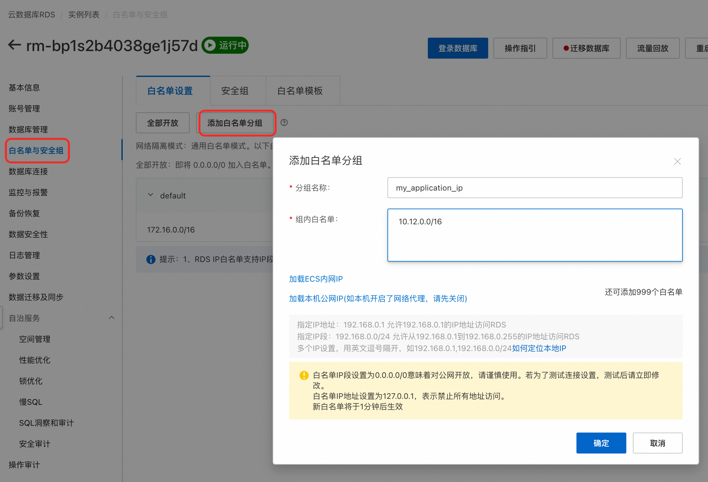
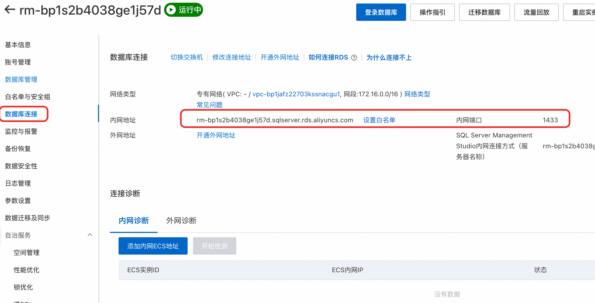
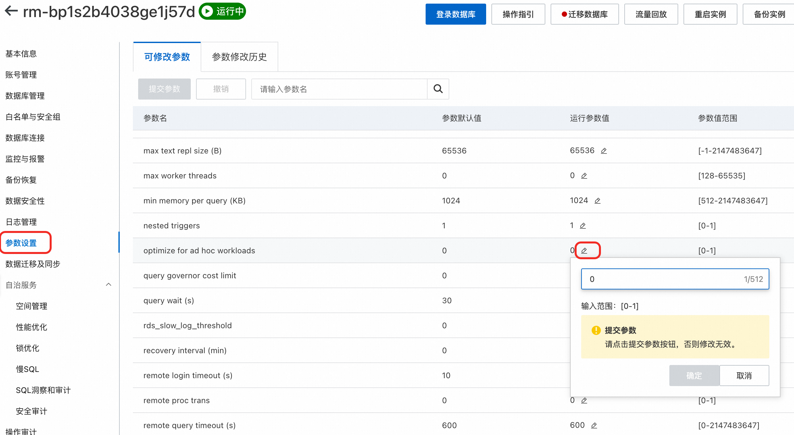
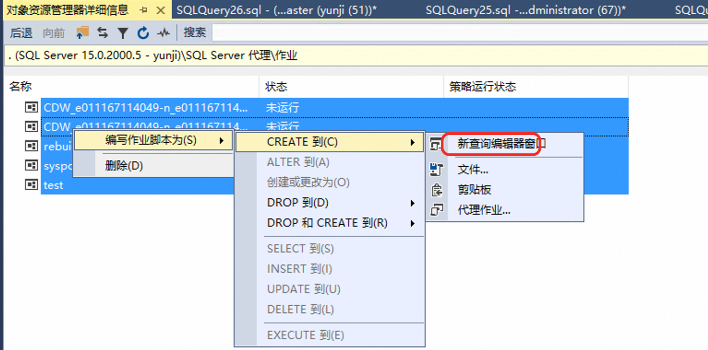
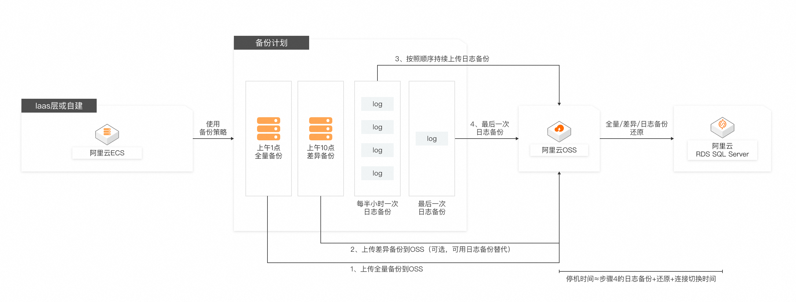
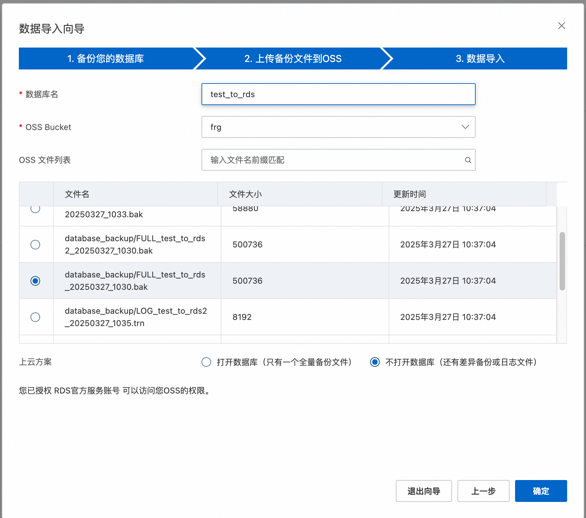
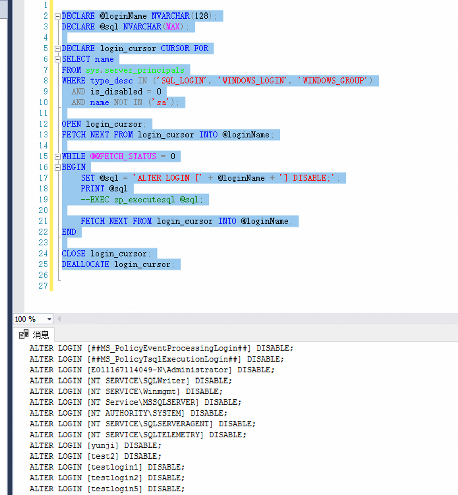

# 简介

物理备份迁移是将SQL Server数据库迁移至阿里云RDS的推荐方法。此方案能够确保数据完整性，同时显著降低迁移过程中的风险及停机时间。相较于逻辑导出导入或第三方工具等其他迁移方式，物理备份还原方法具有更高的效率和可靠性，特别适用于大型数据库或包含特殊对象的数据库迁移场景。

该迁移策略的核心优势在于能够在业务正常运行期间完成大部分迁移工作，仅需在最终切换阶段短暂停机。通过预先还原全量备份，并持续应用差异备份或事务日志备份，可将源数据库与目标RDS实例之间的数据差异控制在最小范围内，为顺利切换提供保障。

整体的迁移流程如下图所示，从线下迁移到RDS，与将数据库从一台机器迁移到另一台机器的整体流程相似。本文将详细介绍各个迁移阶段的操作步骤。

# 事前准备

## 迁移Login

迁移SQL Server实例时可以通过微软官方脚本迁移login，该过程最重要的是保证login的sid一致，从而确保数据库级别内User权限一致，链接：

[https://learn.microsoft.com/en-us/troubleshoot/sql/database-engine/security/transfer-logins-passwords-between-instances](https://learn.microsoft.com/en-us/troubleshoot/sql/database-engine/security/transfer-logins-passwords-between-instances)

## 修改RDS白名单

RDS新购之后，先将使用数据库的各方应用白名单开放，该步骤可以提前验证。

可以在应用侧使用RDS DNS地址测试连接，地址如下所示：

在迁移前，应在应用程序服务器通过telnet RDS实例地址 1433命令确认网络连通性。

## 设置RDS实例参数

可以在RDS控制台，通过“参数管理”设置实例级别的参数，如下图所示。

这两个参数通常值得特别注意：

  * max degree of parallelism - 根据CPU核数以及负载类型（OLTP或OLAP）设置合理的并行度，默认为2

  * cost threshold for parallelism - 设置查询并行化的代价阈值，建议设置为50

## 迁移作业

可以通过Management Studio将作业脚本导出的方式迁移作业，这里注意并不是每一个作业都需要导出，通常一些计划任务，备份相关的作业不再需要导出，RDS已经具备了这些基本的PaaS层能力。

# 数据迁移

数据迁移的最佳实践是通过割接时间窗口之外进行全量数据库迁移，在割接窗口仅进行最小化的差异数据割接，整体流程如下：

数据迁移流程主要包括：

1\. 在业务低峰期进行全量备份并还原到RDS

2\. 定期进行差异备份或日志备份并还原，缩小差距

3\. 在割接窗口内执行最后一次日志备份和还原

4\. 将数据库带上线并切换应用连接

## 备份原实例上的库
    
    
    -- SQL Server 数据库备份脚本
    
    -- 参数设置
    DECLARE @DatabaseList NVARCHAR(MAX) = N'testdb1,testdbtde,testdb_copyonly'; -- 多个数据库用逗号分隔
    DECLARE @BackupPath NVARCHAR(500) = N'D:\Backups\'; -- 备份文件保存路径
    DECLARE @IsWebVersion BIT = 0; -- 0=非Web版本(启用压缩)，1=Web版本(不启用压缩)
    DECLARE @BackupType CHAR(1) = 'L'; -- F=全量备份，D=差异备份，L=日志备份
    DECLARE @DateStamp NVARCHAR(20) = CONVERT(NVARCHAR(10), GETDATE(), 112); -- YYYYMMDD格式日期
    DECLARE @TimeStamp NVARCHAR(10) = REPLACE(CONVERT(NVARCHAR(5), GETDATE(), 108), ':', ''); -- HHMM格式时间
    
    -- 用于临时存储的表变量
    DECLARE @Databases TABLE (
        DatabaseName NVARCHAR(128)
    );
    
    -- 解析数据库列表
    INSERT INTO @Databases
    SELECT LTRIM(RTRIM(value)) 
    FROM STRING_SPLIT(@DatabaseList, ',');
    
    -- 备份选项
    DECLARE @BackupOptions NVARCHAR(100);
    IF @IsWebVersion = 1
        SET @BackupOptions = N'INIT, STATS = 10';
    ELSE
        SET @BackupOptions = N'COMPRESSION, INIT, STATS = 10';
    
    -- 备份类型前缀
    DECLARE @TypePrefix NVARCHAR(10);
    IF @BackupType = 'F' SET @TypePrefix = N'FULL_';
    ELSE IF @BackupType = 'D' SET @TypePrefix = N'DIFF_';
    ELSE IF @BackupType = 'L' SET @TypePrefix = N'LOG_';
    
    -- 备份文件扩展名
    DECLARE @FileExtension NVARCHAR(5);
    IF @BackupType = 'L' SET @FileExtension = N'.trn';
    ELSE SET @FileExtension = N'.bak';
    
    -- 创建并执行备份命令
    DECLARE @CurrentDB NVARCHAR(128);
    DECLARE @BackupFile NVARCHAR(500);
    DECLARE @SqlCommand NVARCHAR(MAX);
    DECLARE @BackupDescription NVARCHAR(255);
    
    -- 数据库游标
    DECLARE db_cursor CURSOR FOR
    SELECT DatabaseName FROM @Databases;
    
    OPEN db_cursor;
    FETCH NEXT FROM db_cursor INTO @CurrentDB;
    
    WHILE @@FETCH_STATUS = 0
    BEGIN
        -- 构建文件名 (格式: 类型_数据库名_YYYYMMDD_HHMM.扩展名)
        SET @BackupFile = @BackupPath + @TypePrefix + REPLACE(@CurrentDB, ' ', '_') + 
                          N'_' + @DateStamp + N'_' + @TimeStamp + @FileExtension;
        
        -- 构建描述
        SET @BackupDescription = CASE 
                                    WHEN @BackupType = 'F' THEN '全量备份'
                                    WHEN @BackupType = 'D' THEN '差异备份'
                                    ELSE '日志备份'
                                 END + ' - ' + @CurrentDB + ' - ' + 
                                 CONVERT(NVARCHAR(30), GETDATE(), 120);
        
        -- 构建备份命令
        IF @BackupType = 'F'
            SET @SqlCommand = N'BACKUP DATABASE [' + @CurrentDB + N'] TO DISK = N''' + 
                              @BackupFile + N''' WITH ' + @BackupOptions + 
                              N', NAME = N''' + @BackupDescription + N'''';
        ELSE IF @BackupType = 'D'
            SET @SqlCommand = N'BACKUP DATABASE [' + @CurrentDB + N'] TO DISK = N''' + 
                              @BackupFile + N''' WITH DIFFERENTIAL, ' + @BackupOptions + 
                              N', NAME = N''' + @BackupDescription + N'''';
        ELSE IF @BackupType = 'L'
            SET @SqlCommand = N'BACKUP LOG [' + @CurrentDB + N'] TO DISK = N''' + 
                              @BackupFile + N''' WITH ' + @BackupOptions + 
                              N', NAME = N''' + @BackupDescription + N'''';
        
        -- 打印命令(调试用)
        PRINT N'正在备份数据库: ' + @CurrentDB;
        PRINT @SqlCommand;
        
        -- 执行备份命令
        BEGIN TRY
            EXEC sp_executesql @SqlCommand;
            PRINT N'数据库 [' + @CurrentDB + N'] 备份成功，文件: ' + @BackupFile;
        END TRY
        BEGIN CATCH
            PRINT N'数据库 [' + @CurrentDB + N'] 备份失败: ' + ERROR_MESSAGE();
        END CATCH
        
        FETCH NEXT FROM db_cursor INTO @CurrentDB;
    END
    
    CLOSE db_cursor;
    DEALLOCATE db_cursor;
    PRINT N'所有指定的数据库备份完成。';

备份后的文件如图所示

一次全备+一次差异+两次日志备份，通过时间戳和修改时间能确定先后顺序

## 上传到OSS

将备份文件上传到OSS，如果数据库备份较小，例如小于5GB，可以直接通过阿里云控制台进行，简化操作，如果备份较大，需要通过OSS的客户端或SDK进行。

## 进行上云恢复

### 还原全量备份

将备份上传到OSS之后，还原全量备份可以在事前进行。

### 还原增量或差异备份

## 停机等待上线

### 原实例禁用写入

原实例禁用所有Login，防止有新增的数据写入，使用下述脚本

注意：下述脚本仅打印，不执行，需要验证SQL后手动执行。
    
    
    DECLARE @loginName NVARCHAR(128);
    DECLARE @sql NVARCHAR(MAX);
    
    DECLARE login_cursor CURSOR FOR
    SELECT name
    FROM sys.server_principals
    WHERE type_desc IN ('SQL_LOGIN', 'WINDOWS_LOGIN', 'WINDOWS_GROUP')
      AND is_disabled = 0
      AND name NOT IN ('sa');
    
    OPEN login_cursor;
    FETCH NEXT FROM login_cursor INTO @loginName;
    
    WHILE @@FETCH_STATUS = 0
    BEGIN
        SET @sql = 'ALTER LOGIN [' + @loginName + '] DISABLE;';
        PRINT @sql
        --EXEC sp_executesql @sql;
    
        FETCH NEXT FROM login_cursor INTO @loginName;
    END
    
    CLOSE login_cursor;
    DEALLOCATE login_cursor;

禁用所有Login之后，为了避免存在长连接，可以重启原实例的SQL Server。

### 执行最后一次备份&还原操作

该步骤参考之前的“上传增量文件”，这里不再赘述。

### 上线数据库

上线数据库本质是对应restore with recovery步骤，操作界面如图，可以看到一致性选择有两个选项，这里建议选择“一步执行DBCC”。

## 数据库上线之后

### 更新统计信息

数据库迁移之后，同样的负载会变慢一个比较常见的原因是没有及时更新统计信息，我们可以在数据库中执行SQL更新统计信息，如下所示。
    
    
    EXEC sp_updatestats;
    GO

也可以通过阿里云控制台更新统计信息。

### 使用阿里云DAS确认瓶颈

上线后使用阿里云DAS进行性能监控，及时发现并优化可能存在的性能瓶颈。如图所示，一些明显有问题的语句，可以很容易定位捕获，并进行针对性的调优。

# 小结

本文详细介绍了将SQL Server数据库从线下迁移到阿里云RDS的完整流程，主要包括以下几个方面：

  1. 事前准备：包括迁移Login、修改RDS白名单、设置RDS实例参数及迁移必要的作业

  2. 数据迁移：通过备份还原方式进行，包括全量备份、差异备份和日志备份的制作与恢复

  3. 割接切换：在业务低峰期进行最小化停机迁移，包括禁用源库写入、执行最后一次备份还原和上线数据库

  4. 上线后优化：更新统计信息并使用阿里云DAS进行性能监控

通过遵循本文的物理备份上云流程，可以确保SQL Server数据库迁移到阿里云RDS的过程平稳、高效，最大限度减少业务中断时间，同时保证迁移后的数据库性能达到预期。

迁移后建议持续监控系统性能一段时间，对可能出现的问题进行及时调整，确保业务系统稳定运行。
